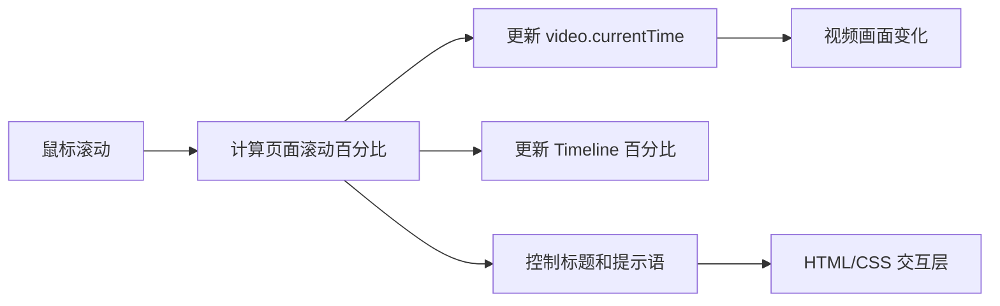

# 0801 GitHub Code Study

这是一个持续扩展的研究 Demo 仓库，用来记录我们如何把视觉参考拆解成可运行、可验证的网页体验。

在线仓库：[yydshly/0801_githubcode_study](https://github.com/yydshly/0801_githubcode_study)

## 项目索引

所有研究项目都放在独立的子目录中，并按创建顺序编号。

| 编号 | 子项目 | 研究重点 | 状态 | Demo | 文档 |
| --- | --- | --- | --- | --- | --- |
| 01 | [Finance Header - Wallet](./wallet-finance-header/) | 滚动驱动的视频 Header | 已完成 | [本地预览](http://127.0.0.1:5191/) | [项目说明](./wallet-finance-header/README.md) |

后续项目会继续追加到这张表中，保持“一个研究问题对应一个独立子项目”的边界。

## 研究项目 01：Finance Header - Wallet

项目位于 [`wallet-finance-header`](./wallet-finance-header/)，是一个沉浸式的 Wallet 财务/加密资产 Header 原型。

### Demo 演示

启动开发服务器后，可以直接打开：[打开 Wallet Demo](http://127.0.0.1:5191/)

```powershell
cd wallet-finance-header
npm install
npm run dev
```

体验路径：

1. 首屏看到宇宙、月球和宇航员双手，以及 `Connect your wallet`。
2. 向下滚动，视频画面会跟随滚动位置变化，左下角时间线从 `00%` 走到 `100%`。
3. 接近页面底部后，视频自动播放尾段，并出现 `Hold the Future in Your Hands.`。
4. 点击右上角菜单可以打开 Portal Directory，点击 Contact Us 可以打开联系表单。

> 这里的链接指向本机开发服务器，只在本地启动项目后有效。若要让其他人直接访问，需要把子项目部署到静态托管服务，再将公开地址替换到这里。

### 运行、构建与测试

```powershell
cd wallet-finance-header
npm install
npm run dev
```

```powershell
npm run build
npm test
```

## 实现原理

这个 Demo 的本质不是实时 3D，而是：

> 一段预渲染视频 + 一个由鼠标滚动控制的视频时间轴 + 叠加在视频上方的 HTML/CSS 界面。

工作流程如下：

1. 页面外层设置为大于一个屏幕的滚动空间，当前项目使用 `250vh`。
2. 内层场景使用 `position: sticky` 固定在视口中，因此滚动时场景保持在屏幕上。
3. 监听页面滚动位置，将滚动距离归一化为 `0～1` 的进度百分比。
4. 在视频前 95% 的时间线上，根据进度修改 `video.currentTime`：

   ```js
   video.currentTime = scrollProgress * 4;
   ```

5. 页面接近底部时，让视频从指定时间点继续自动播放尾段，并循环尾部画面。
6. 标题、按钮、滚动提示和 `Timeline / 00% → 100%` 都是叠加在视频上方的 HTML/CSS 元素。

因此，用户看到的“滚动驱动宇宙场景”，本质上就是把鼠标滚轮映射成了视频播放位置；它没有在浏览器中实时计算 3D 摄像机、模型、灯光或粒子。



## 技术组成

- React：组件、状态和表单交互
- Vite：本地开发与生产构建
- Tailwind CSS：布局、响应式和视觉样式
- Framer Motion：标题、提示语、抽屉和弹窗过渡
- HTML5 Video：承载主视觉视频并响应滚动时间轴

Wallet 连接和 Contact Us 是原型级模拟交互，不会访问真实链上服务或发送真实网络消息。

## 仓库结构

```text
0801_codex_project/
├─ README.md                         # 研究仓库总览与项目索引
├─ wallet-finance-header/            # 研究项目 01
│  ├─ README.md                      # 子项目说明与运行方式
│  ├─ docs/                          # 子项目验证记录
│  ├─ src/                           # React 页面与交互实现
│  └─ tests/                         # 可自动化验证的逻辑
└─ docs/                             # 研究过程中的设计契约与实现计划
```

## 新增研究项目约定

新增子项目时：

1. 在仓库根目录创建独立目录，例如 `project-02-name/`。
2. 子项目内部必须有自己的 README，写清楚目标、运行方式和实现原理。
3. 在本 README 的“项目索引”中追加编号、研究重点、状态、Demo 和文档链接。
4. 如果有本地 Demo，统一说明启动命令和本地访问地址；如果部署到公开地址，再替换为公开链接。
5. 不把多个研究项目的源码、依赖或验证记录混在同一个子目录里。

## 项目文档

- [子项目说明](./wallet-finance-header/README.md)
- [验证记录](./wallet-finance-header/docs/verification-coverage.md)
- [设计契约](./docs/superpowers/specs/2026-08-02-wallet-finance-header-design.md)
- [实现计划](./docs/superpowers/plans/2026-08-02-wallet-finance-header.md)
