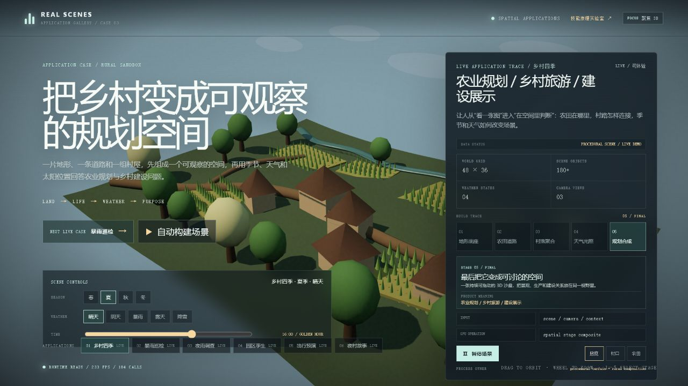
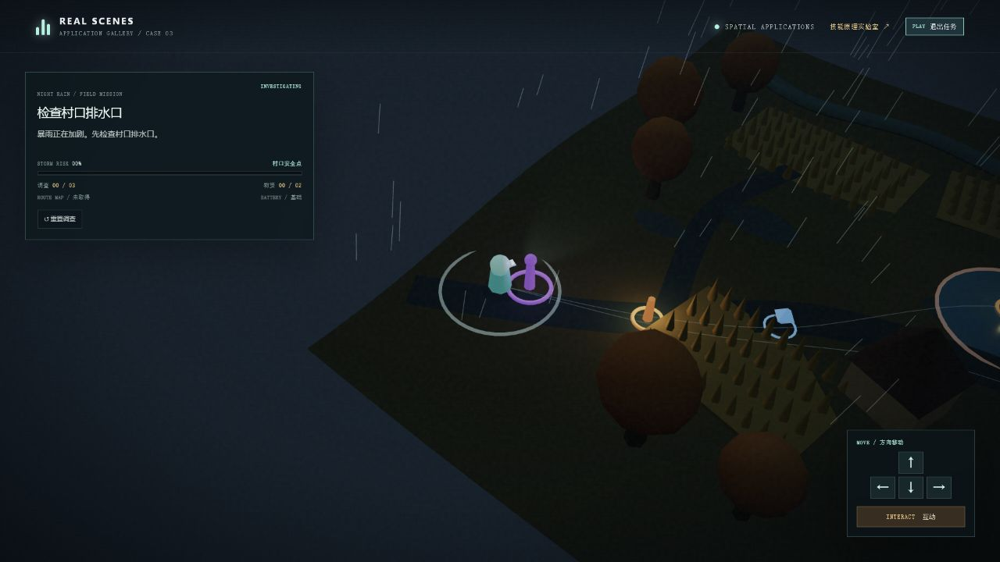
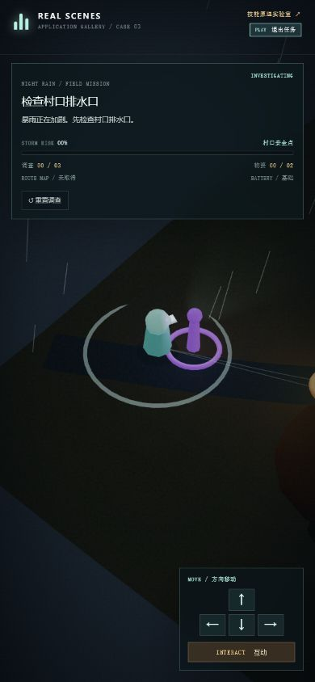

# 应用展厅与夜雨调查体验审查

审查日期：2026-08-04  
审查范围：应用展厅入口、夜雨调查桌面初始状态、夜雨调查手机初始状态。  
用户目标：快速理解“这个 Skill 能做什么”，进入案例后能看懂目标、顺利操作，并感受到它已经接近一款游戏。

## 流程证据

### Step 1 — 应用展厅入口（健康度：中）

- 优点：3D 场景、产品意义、构建阶段和场景控制都在同一屏，能够说明“视觉能力如何转化为应用”。
- 问题：主标题、右侧说明、左下控制、底部应用目录同时争夺注意力；用户第一次进入时，不容易判断应该先看说明、切场景还是直接操作 3D。
- 优化：增加唯一的首要动作“开始体验当前案例”，把构建过程与参数控制折叠为次级说明；应用目录增加场景类别和难度/用途标签。

### Step 2 — 夜雨调查桌面任务（健康度：中上）

- 优点：目标、风险、调查数、物资数和操作区都可见；角色、任务节点、危险区和路线已经构成完整游戏闭环。
- 问题：场景中的紫色、橙色、蓝色圆环依赖颜色和抽象造型，用户不知道它们分别是什么；当前目标只写在左上 HUD，缺少世界空间中的箭头、距离和名称。
- 问题：角色和村屋仍是程序化几何体，缺少行走动画、地面脚步、水花、灯光照射反馈和镜头轻微跟随，导致“技术上是 3D，感受上仍像沙盘”。
- 优化：增加目标方向箭头、距离、空间标签和简易地图；加入角色移动动画、脚步/水花、交互进度和完成镜头；危险区使用纹理、波纹与警示边缘，而不只依赖颜色。

### Step 3 — 夜雨调查手机任务（健康度：中）

- 优点：390 × 844 无横向溢出，任务 HUD、角色和操作区都能同时显示。
- 问题：方向按钮约 32 × 27 px，互动按钮高度约 25 px，明显偏小；互动按钮文字约 8 px。雨夜环境中，误触和读不清的风险较高。
- 问题：HUD 占据顶部约 193 px，但最重要的“下一目标方向和距离”仍不在其中；手机屏幕的大部分空间用于场景，却缺少导航辅助。
- 优化：方向区改成至少 48 px 的虚拟摇杆或大触控区，互动按钮至少 48 px 高；HUD 改成一行任务摘要 + 可展开详情；增加手机震动反馈和触控按下状态。

## 最高优先级建议

### P0 — 让玩家不迷路

1. 世界空间目标标签、方向箭头、距离显示。
2. 小地图或简化路线雷达，已完成节点明显变色并淡出。
3. 首次 30 秒分步引导：移动 → 靠近 → 互动 → 查看风险。

### P1 — 让它真正“像游戏”

1. 角色行走/转向动画，湿地脚步、水花和手电筒摆动。
2. 任务交互进度、成功音效、镜头聚焦和完成结算。
3. 增加一个有选择的事件，例如“先救泵站还是先封路”，使场景状态影响结果。
4. 加入音频层：雨声、远雷、脚步、积水、任务提示与安全点环境声。

### P2 — 提升长期产品价值

1. 保存与继续、任务记录、最佳完成时间和风险评级。
2. 使用 glTF 角色、房屋、树木与道具替换部分基础几何体，保留程序化地形和天气。
3. 把关卡目标、危险区和路线做成可编辑数据，后续可以快速生成农村巡检、园区巡检、露营预演等关卡。
4. 增加低/中/高画质档和动态分辨率，为手机性能与耗电做准备。

## 可访问性风险

- 场景节点目前主要依赖颜色区分，需要同时加入图标、文字或形状差异。
- 手机操作目标尺寸偏小，需要扩大并提供清晰按下状态。
- 雨、闪电和持续运动需要“减少动态效果”选项；闪电频率和亮度仍需专门测试。
- 本次从截图和可见 DOM 检查了布局、标签和目标尺寸，但不能仅凭这些证据声明屏幕阅读器、色彩对比度或完整键盘顺序符合 WCAG。

## 建议实施顺序

先做 P0 导航与新手引导，再做 P1 角色反馈和音频。完成这两组后，夜雨调查会从“可运行的 Three.js 任务”明显迈向“可玩的游戏原型”；资产升级、存档和更多关卡放到下一阶段。
