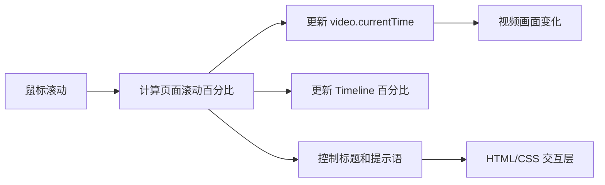

# Finance Header - Wallet

这是研究项目的第一个子项目：一个沉浸式、滚动驱动的 Wallet 财务/加密资产 Header 原型。

- [打开在线 Demo](https://yydshly.github.io/0801_githubcode_study/projects/wallet-finance-header/)
- [返回研究项目总展厅](https://yydshly.github.io/0801_githubcode_study/)

## 体验路径

1. 首屏看到宇宙、月球和宇航员双手，以及 `Connect your wallet`。
2. 向下滚动，视频画面会跟随滚动位置变化，左下角时间线从 `00%` 走到 `100%`。
3. 接近页面底部后，视频自动播放尾段，并出现 `Hold the Future in Your Hands.`。
4. 点击右上角菜单可以打开 Portal Directory，点击 Contact Us 可以打开联系表单。

## 本地运行

```powershell
cd wallet-finance-header
npm install
npm run dev
```

生产构建与单元测试：

```powershell
npm run build
npm test
```

## 已实现

- 以 `https://cdn.jiro.build/Wallet/Astro.mp4` 为主视觉素材，滚动位置驱动视频时间线。
- 首屏/终点状态：`Connect your wallet`、`Hold the Future in Your Hands.`、`Timeline / 00% → 100%`。
- Wallet 状态切换、Portal Directory 抽屉、Connect Keystore 模拟连接反馈。
- Contact Us 弹窗、表单提交成功态、自动关闭和焦点回收。
- 桌面、平板、移动端响应式布局，无横向滚动溢出。
- `prefers-reduced-motion` 下暂停视频 scrub 与界面动效，并提供静态画面回退。

视觉素材来自外部 CDN；离线或加载失败时，界面会保留可用的黑色静态背景、内容和交互。

## 实现原理

这个 Demo 的本质不是实时 3D，而是：

> 一段预渲染视频 + 一个由鼠标滚动控制的视频时间轴 + 叠加在视频上方的 HTML/CSS 界面。

工作流程如下：

1. 页面外层设置为大于一个屏幕的滚动空间，当前项目使用 `250vh`。
2. 内层场景使用 `position: sticky` 固定在视口中，因此滚动时场景保持在屏幕上。
3. 监听页面滚动位置，将滚动距离归一化为 `0～1` 的进度百分比。
4. 在视频前 95% 的时间线上，根据进度修改 `video.currentTime`：

   ```js
   video.currentTime = scrollProgress * 4;
   ```

5. 页面接近底部时，让视频从指定时间点继续自动播放尾段，并循环尾部画面。
6. 标题、按钮、滚动提示和 `Timeline / 00% → 100%` 都是叠加在视频上方的 HTML/CSS 元素。

因此，用户看到的“滚动驱动宇宙场景”，本质上就是把鼠标滚轮映射成了视频播放位置；它没有在浏览器中实时计算 3D 摄像机、模型、灯光或粒子。



## 技术组成

- React：组件、状态和表单交互
- Vite：本地开发与生产构建
- Tailwind CSS：布局、响应式和视觉样式
- Framer Motion：标题、提示语、抽屉和弹窗过渡
- HTML5 Video：承载主视觉视频并响应滚动时间轴

Wallet 连接和 Contact Us 是原型级模拟交互，不会访问真实链上服务或发送真实网络消息。

## 相关文档

- [验证记录](./docs/verification-coverage.md)
- [设计契约](../docs/superpowers/specs/2026-08-02-wallet-finance-header-design.md)
- [实现计划](../docs/superpowers/plans/2026-08-02-wallet-finance-header.md)
